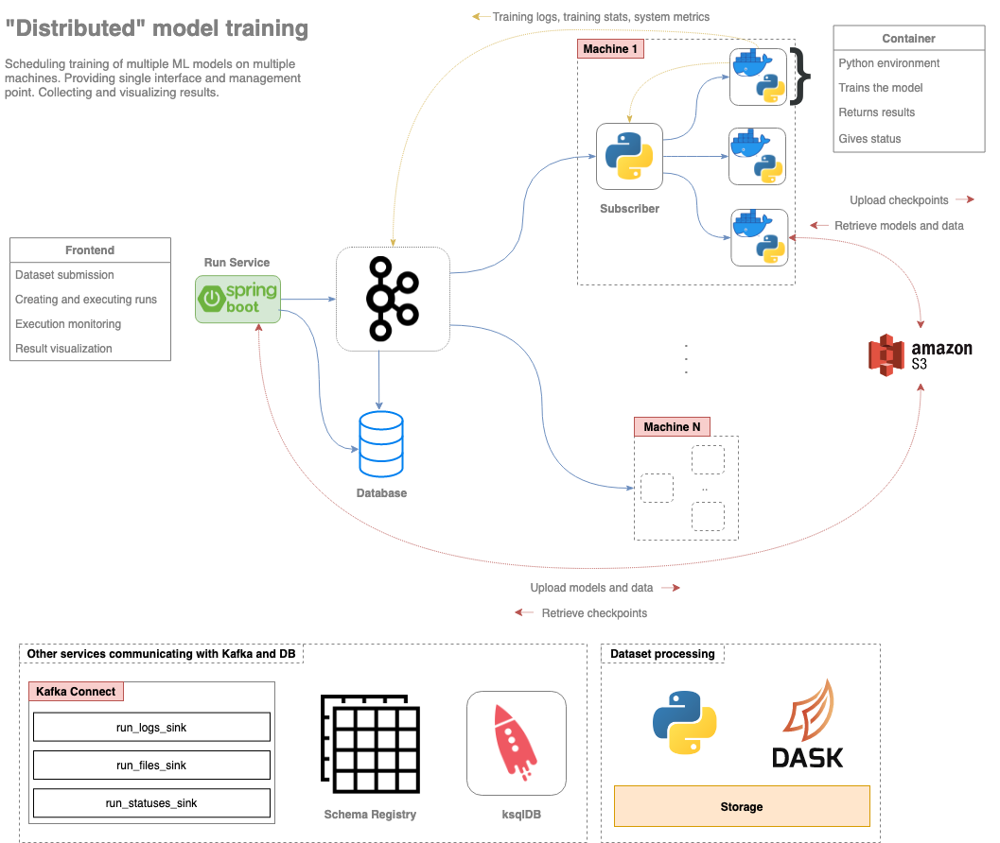
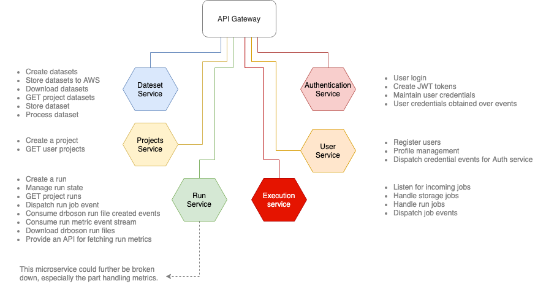
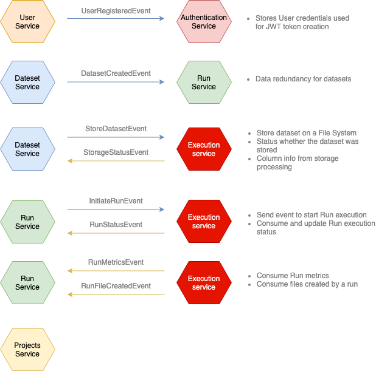

* Editing in progress. Currently there are only diagrams giving an overview of the different services and their interraction.

# DRBoson
Microservice implementation of the DRBoson project. This repository contains the code of all services whose development is done in separate repositories.

## Table of Contents

- [Architecture](#architecture)
- [Services](#services)
- [Execution Agent](#python-agent)
- [Communication](#communication)
- [Frontend](#frontend)

## Architecture

Overview of the DRBoson architecture, where the services are depicted as a single "Run Service".

  

## Services

Overview of the different services in DRBoson, along with their responsibilities.

  

Events exchanged across different microservices.

  

